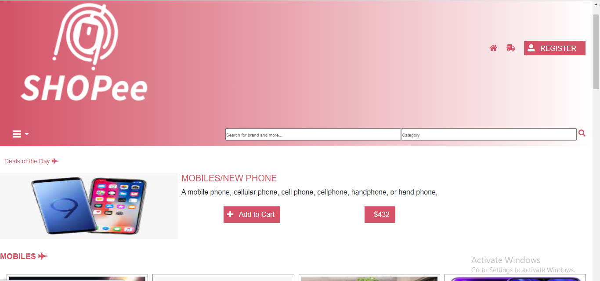

# SHOPee-ONLINE ELECTRONIC SHOP
This is Online Electronics shop html page.
In the process of making this website,I learn some  techniques like float, position, grid, flex ,bootstrap, and various property which made our project more flexible.

# Original Design

Original Design link :(https://www.behance.net/gallery/24796463/ZATTIX)
  
# Project Design

Project Design Screenshot : 

# Github link:

- Clonning the project: git clone (https://github.com/Deepakdanger/Online_market_SHOPee.git)
- To open folder : cd .\Online_market_SHOPee\
- Live link:(https://deepakdanger.github.io/Online_market_SHOPee/)
- Video link :(https://www.loom.com/share/c06c033af58d4681aab447f2ab0a5136)

# Instruction

For the: [Github-link](https://github.com/Deepakdanger/Online_market_SHOPee/tree/market1)

## Navigation bar

- Used flex to create two division one for LOGO & second for Icon and register button .
- Used icon with dropdown and search input.

## Deals of day section

- Used carousel and bootstrap and put an image and other discription in flex. 

## Category section

- Various Deals is here of different category

## footer section

- Used image and description and using flex for other section.
- Add icons of social media and copyright

## Checkout(2nd HTML) page
## Navigation bar

- Use icon for register.

## Sorting section

- Used radio for select only one option in price and size
- Used checbox for selecting multiple option in brand and category
- Used flex for display flex
- Used bootstrap Paging to create paging 

# Technology Used

- HTML
- CSS
- Font Awesome icons

# Authors
- Name :Deepak kumar
- Githhub :https://github.com/Deepakdanger

# Show your support
- Support by giving star

# Acknowledgement
- Mohammed Awad
- Microverse

## 📝 License

This project is [MIT](https://github.com/git/git-scm.com/blob/master/MIT-LICENSE.txt) licensed.

